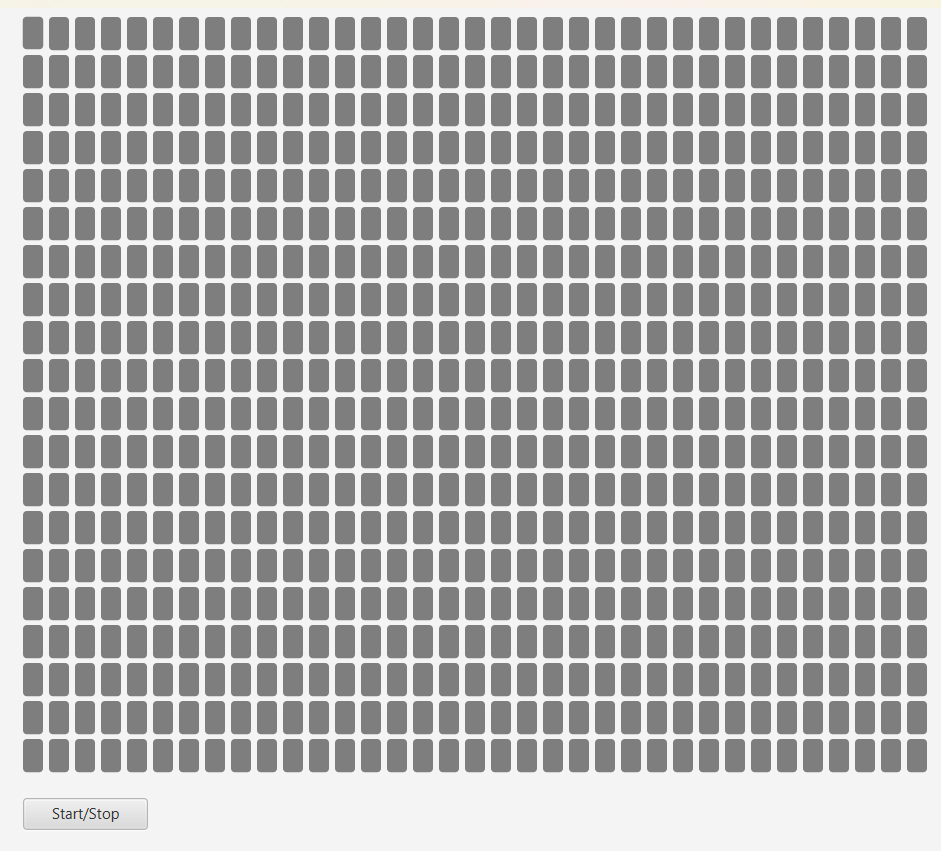
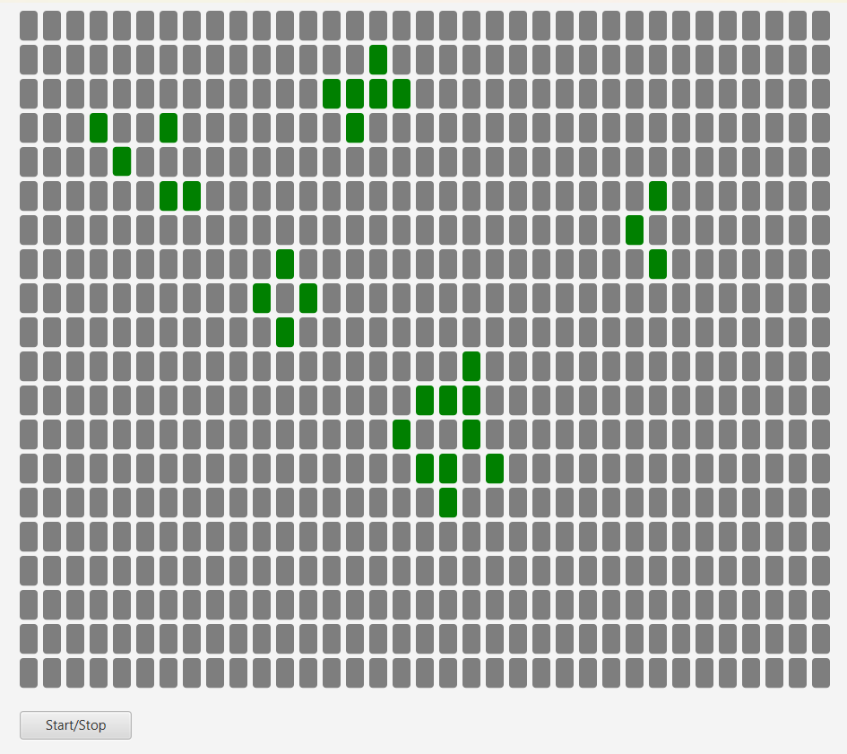
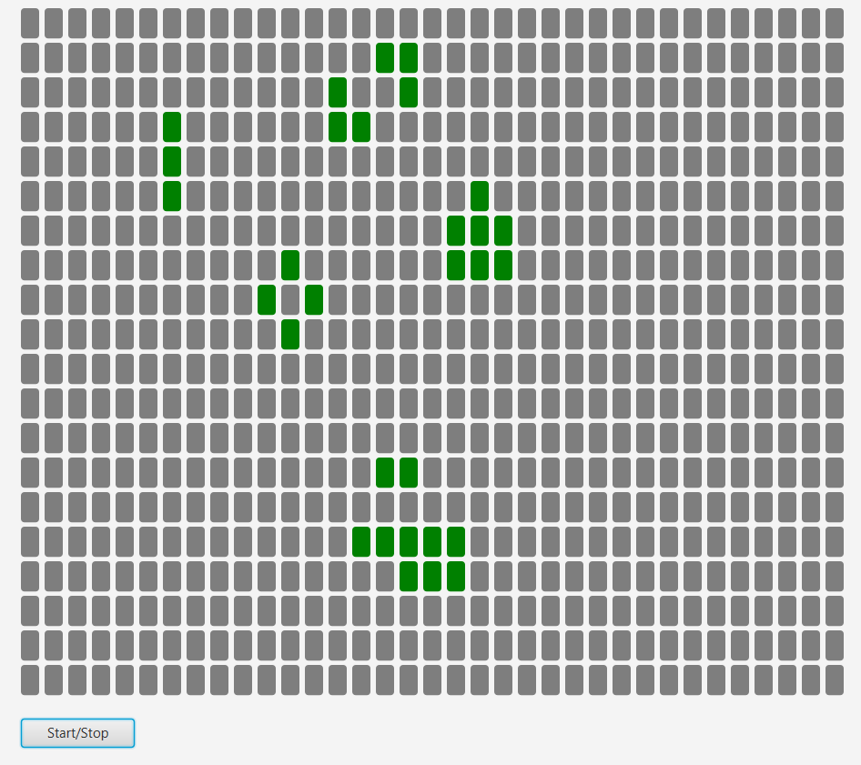

# Game of Life

Aby uruchomić aplikację należy użyć komend:

```cmd
mvn test
mvn exec:exec
```

Przycisk Start/Stop rozpoczyna lub przerywa symulację. Naciskając na przyciski wskazujemy, które komórki są żywe. Po kliknieciu przycisku start rozpocznie się symulacja automatu komórkowego Game of Life.

## Przykłady:

 \
 \
 